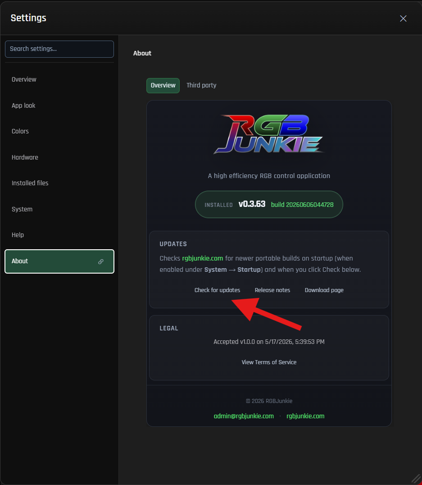

# Check for updates

RGBJunkie makes it easy to stay up-to-date! You can download the latest updates directly from rgbjunkie.com without needing to reinstall the application manually.

1. Open **Settings → About**.
2. Click **Check for updates**.
3. If a newer version is available, simply follow the prompts within the app to download and install it.

Every time you check, RGBJunkie loads the most current release information directly from our website. This means you don't need to restart the app first to see a new build that might have been published after you opened RGBJunkie.

## Release notes

When an update is ready, the update dialog will conveniently show you **What's new** for all versions released between your current installed build and the very latest.

- Selecting **All release notes** will open the complete in-app history.
- If any version details are missing from your install, RGBJunkie can load them from [rgbjunkie.com](https://rgbjunkie.com/RGBJunkieApp/changelog/) to ensure you have the full picture.

You can also explore the full history of every version on our website's dedicated [Changelog](/RGBJunkieApp/changelog/) page.

## If an update fails

If you encounter any issues during an update, here are a few things to check:

-   **Permissions:** Please ensure you have the necessary permissions to write to the RGBJunkie install folder. If RGBJunkie is installed in a protected location like Program Files, you might need administrator rights to successfully complete the update.
-   **Alternative Download:** If the in-app updater continues to fail, you can try downloading the portable ZIP version directly from our [download page](/RGBJunkieApp/#download).
-   **Report an Issue:** If the problem persists, sending us a report from **Settings → Logs** can help us diagnose what's going wrong. When reporting, please be sure to include details like your current RGBJunkie version and any specific error messages you've seen.

> After a successful update, you can expect RGBJunkie to restart cleanly without leaving any background watcher windows open.

## Related

-   [Scene profiles](scene-profiles) — It's always a good idea to save your layout before making significant changes!