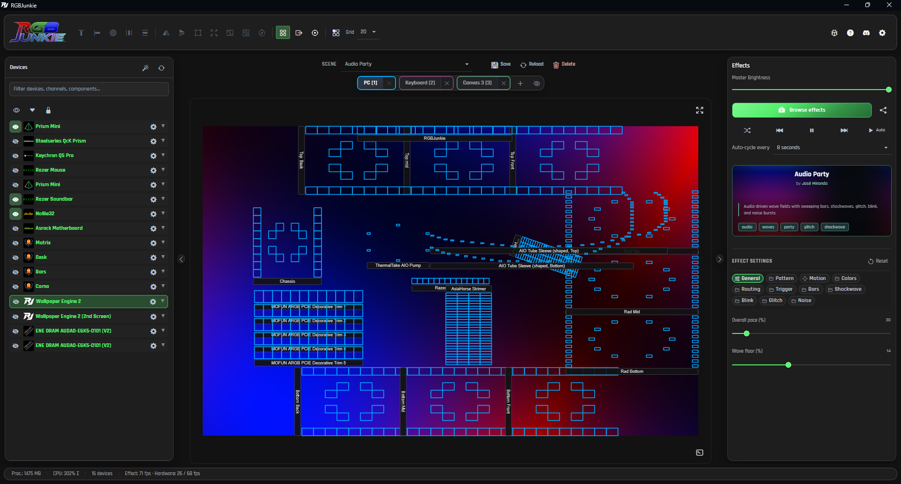
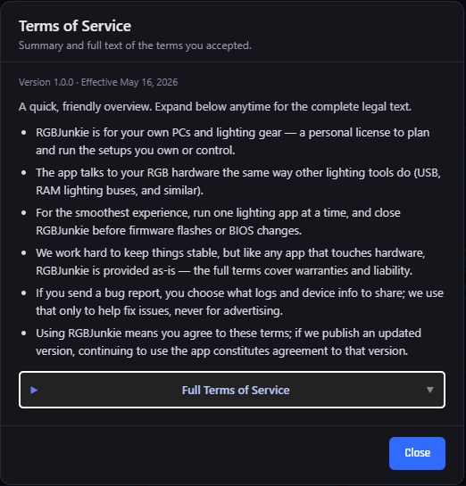
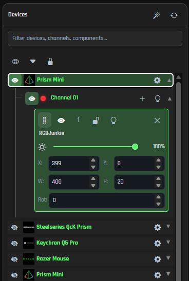
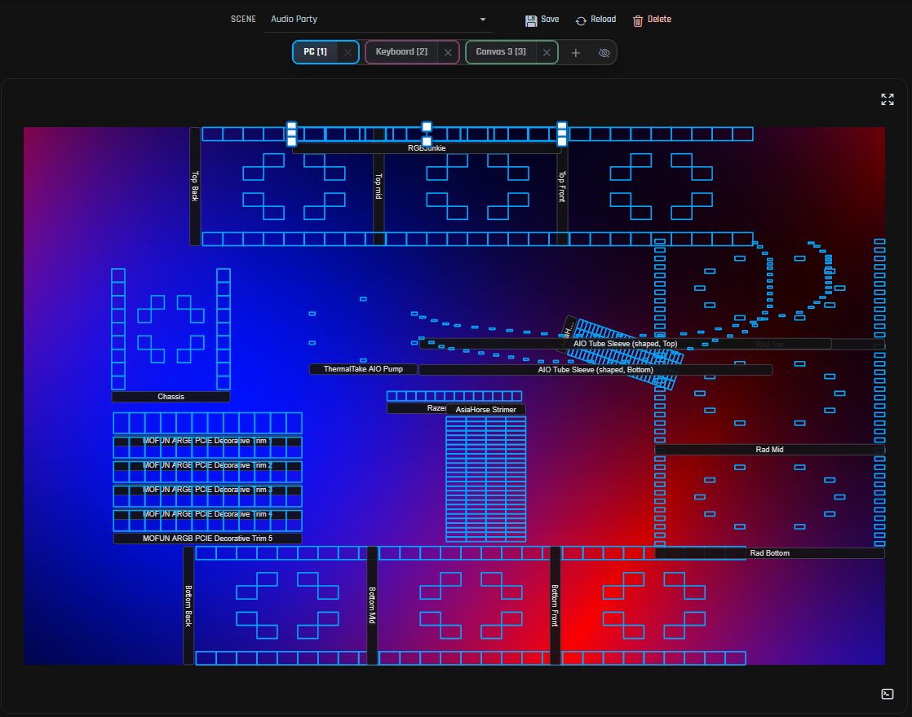
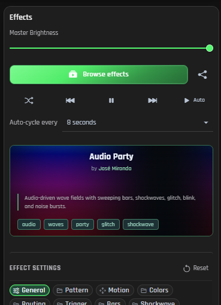
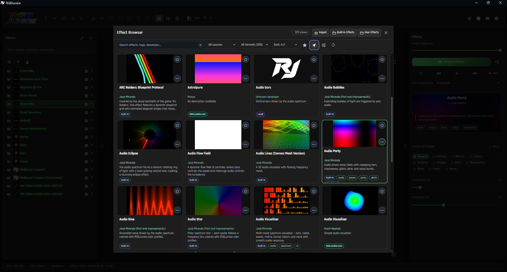
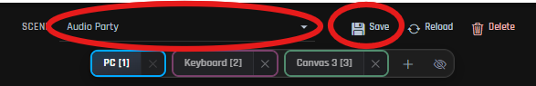

# Quick start

This guide will swiftly take you from downloading RGBJunkie to illuminating your entire desk! For an even deeper dive into all the features, shortcuts, and troubleshooting tips, open **Settings → Help** in the app — it loads the full Help Center from rgbjunkie.com.

## Download and install

1. First things first, grab the latest version of RGBJunkie from our official [download page](/RGBJunkieApp/#download).
2. Run the installer (or simply unzip the portable build) and then launch **RGBJunkie** to get started.
3. You'll be prompted to accept our Terms of Service – a quick click and you're in!

> **Tip:** Keep your RGBJunkie experience fresh! You can always use **Settings → About → Check for updates** later to ensure you're running the latest and greatest version. For more details, check out our [Check for updates](check-for-updates) guide.

## Know the layout

### Devices panel

Everything RGBJunkie sees lives here — USB controllers, WLED you added by hand, virtual devices from plugins. Devices split into **channels** (one strip, one fan header…), and channels hold **components** on your canvas — except fixed-layout keyboards and mice, which come pre-mapped.

### Canvas panel

Your LED layout, live on screen. The **Scene** picker in the bar above saves everything you see — tabs, components, effects, sliders. Use multiple **canvas tabs** for different zones (PC case, desk, keyboard…). Go wild.

> Need more room to admire your setup? Feel free to collapse either side panel with a click! The handy **fullscreen** button on the canvas will maximize your visual preview, letting you see your lighting in all its glory! Just press **Escape** to return.

### Effects Panel

This is where the real fun is! This panel gives you access to a large number of gorgeous built-in effects, as well as the whole database of community effects available in [RGBJunkie.com](RGBJunkie.com). The effect settings are displayed on this panel. Changes to effect settings are automatically saved for each effect, regardless of if they are saved in a scene or not.

## Connect and set up gear

Time to plug in your awesome USB lighting gear! If a device doesn't appear right away, double-check our [supported gear list](/RGBJunkieApp/supported/) – we're always expanding it!

1. In the **Devices** panel on the left, you'll see your connected gear. Keep an eye out for any channels that still need a layout assigned.
2. For a super quick setup, click the **magic-wand** button to launch the **RGB Wizard**. Alternatively, use the **+ Add** button on a channel row to open the **Component Library** and place your components (LED strips, keyboard zones, and more).

The RGB Wizard and Component Library guide you through matching physical LEDs to the canvas preview.

## Choose an effect

Head over to the right panel and open **Browse effects** (or simply pick one that's already part of your current Scene).

1. Select an effect that catches your eye! Instantly, a set of settings will appear, letting you fine-tune things like speed, colors, and many other exciting options.
2. Watch the magic unfold on your canvas preview! Your connected devices will mirror the changes in real time, bringing your desk to life.

Play around with the sliders until your lighting looks absolutely perfect! Remember, you can use different canvas **tabs** to manage distinct lighting zones, like your monitors versus your desk strips, for ultimate control.

## Save your first Scene

Think of a **Scene** as a snapshot of your perfect lighting setup! It cleverly stores your entire layout, canvas tabs, chosen effects, and all your carefully adjusted slider values.

1. Once everything looks just the way you want it, click the **Save** button located in the bar **above your workspace canvas tabs**.
2. Give your masterpiece a memorable name, like `Gaming` for your battle station or `Work` for a more focused ambiance.
3. You can effortlessly switch between your saved Scenes anytime using the **Scene picker** in that very same bar.

Want to learn more about copying, overwriting, and managing your Scenes like a pro? Check out our dedicated guide on [Save and switch Scene profiles](scene-profiles).

## Where to go next

Dig in wherever you are stuck — or just curious:

**Getting your layout right** — [RGB Wizard](rgb-wizard), [Devices panel](devices-panel), [Component Library](component-library), [Workspace editor](workspace-editor), [Canvas tabs](canvas-tabs)

**Effects and color** — [Effects — browse and tune](effects-browse-and-tune), [Color profiles](color-profiles), [LED Studio](led-studio)

**Save and share your work** — [Scene profiles](scene-profiles), [Installed files](installed-files), [Backup your data](backup-restore), [App links](app-links)

**Network and extras** — [WLED setup](wled-setup), [OpenRGB, RAM, and GPU lighting](openrgb-ram-gpu-lighting), [Wallpaper and screen sync](wallpaper-screen-sync), [Tray and startup](tray-and-startup), [Keyboard shortcuts](keyboard-shortcuts)

**Something broke?** — [Supported devices](supported-devices), [Troubleshooting — no lights](troubleshooting-no-lights), [Troubleshooting — wrong colors](troubleshooting-wrong-colors), [Send a support report](send-support-report)

**Also worth bookmarking** — **Settings → Help** in the app, [Check for updates](check-for-updates), the full [Help Center](/RGBJunkieApp/help/), [Changelog](/RGBJunkieApp/changelog/), and the [Effect Builder](/) in your browser

***

You're all set to dive deeper into the world of RGBJunkie! Remember to save a Scene after each major change – it's your secret weapon for effortlessly jumping between amazing looks without ever having to rebuild your desk's ambiance from scratch.