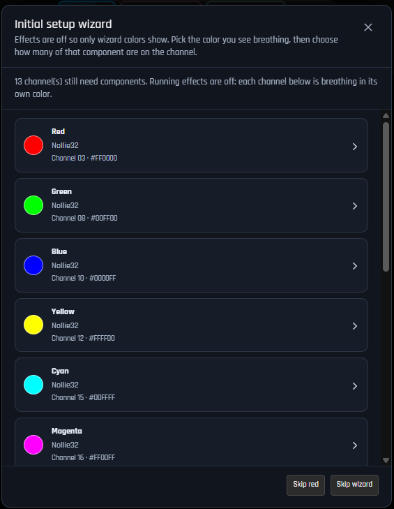
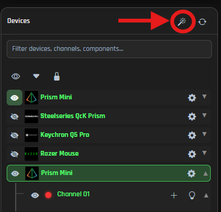
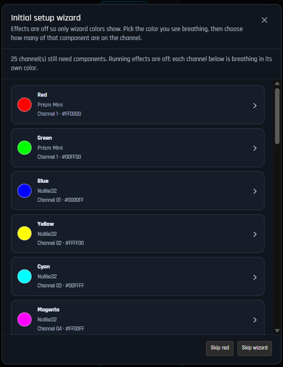
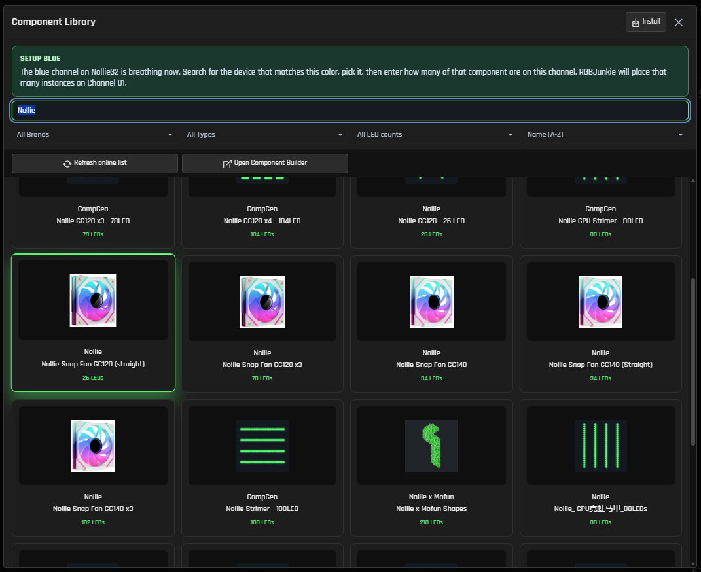
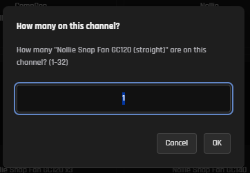
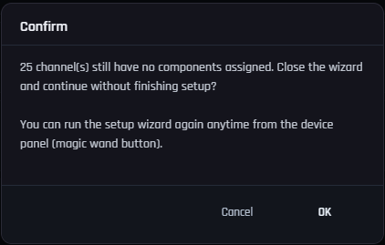
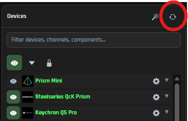
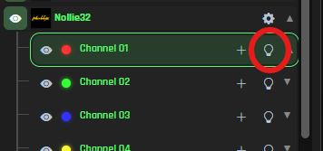

## Initial setup wizard

The setup wizard is here to help you effortlessly connect your real RGB hardware to the right components within RGBJunkie. It gently guides you through each channel on your controllers that doesn't yet have a component assigned, making it super easy to match what you see on your desk with what you select in the app.

## When it appears

* **First launch** — If RGBJunkie discovers controllers with empty channels, the wizard will gracefully open automatically after startup (unless you've previously closed it).
* **Any time** — Feel free to click the friendly magic wand button in the Devices panel toolbar to launch it whenever you like.
* **New hardware** — If you've previously skipped the wizard and then plug in a new controller, RGBJunkie will kindly ask if you'd like to open the wizard specifically for that new device.

Just a heads-up: Keyboards and other fixed-layout devices aren't included here, as they prefer to use their own built-in LED layouts.

## What happens while the wizard is open

* Your current lighting effect will pause, and the workspace canvas will temporarily go dark, so your physical desk lighting becomes your clear guide.
* Each channel that's still waiting for setup will be given its own distinct color (like red, green, blue, yellow, and more).
* You'll see those colors 'breathe' on your hardware—fading from off to full brightness—making them easy to spot, even on long strips (up to the first 200 LEDs on each channel).
* When you select a channel to configure, only that specific channel will continue breathing; other channels will dim until you've finished or decided to go back.

## Step by step

1. **Review the list** — The wizard will present you with a clear list of every channel that still needs a component, each thoughtfully labeled with its unique breathing color, controller name, and channel name.
 
    
2. **Pick a color** — Take a peek at your desk, find the hardware that's gently breathing that color, and simply click the matching row in the wizard.
3. **Choose a component** — The Component Library will open up just for that channel. Feel free to search or browse until you discover the perfect product that matches your hardware (for example, a specific fan, strip, or case model).
    
4. **Enter how many** — RGBJunkie will then kindly ask how many of that component are connected to this channel (you can enter between 1 and 32). It will then neatly place that many instances onto your workspace canvas in a tidy grid, all ready for you to arrange as you like.
    
5. **Repeat** — Once you've finished one channel, the wizard will gracefully return with any remaining colors until every channel is happily assigned—or until you decide to skip.

You can also use the `+ Add` button on any channel row in the Devices tree to open the Component Library directly, without the wizard. The wizard simply adds that helpful breathing-color guide and the convenient quantity prompt to make things even smoother!

## Skip and close

* **Skip selected channel** — This option will gently skip the first color in the list and move you along; you can always assign that channel later from the Devices tree if you wish.
* **Skip wizard / Close / Escape** — Choosing any of these will close the wizard. If some channels are still empty, RGBJunkie will just politely ask you to confirm and give you a friendly reminder that you can always reopen the wizard using the magic wand button whenever you're ready.
* After you skip or close, the wizard won't automatically pop open again until it detects some brand new hardware.

## Tips

* Run **Rescan** (↻) in the Devices panel if you've plugged in a controller *after* the app has already started. It's a great way to make sure everything is detected!
    
* Use **Identify** on a channel row anytime to quickly flash that specific channel on your real device, without needing to run the full wizard. Super handy for quick checks!
    
* Once your components are happily placed, feel free to drag them around on the canvas to perfectly match your physical layout, then go ahead and pick an amazing effect as usual!