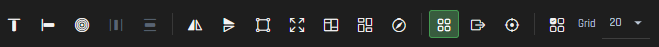

## Laying out your rig

You’ve assigned components — now make the canvas look like your actual desk. Drag fans and strips until the preview matches reality. One tab might be the PC case, another the desk, another the keyboard — whatever makes sense for how you think about the setup.

### Canvas tabs and scenes

* Layout workspaces (tabs) — the strip above the canvas lets you add, rename, and switch tabs. Each component belongs to one tab.
* Scene — the picker above the tabs saves and loads your full setup together: component positions, canvas tabs, and effect settings. Many changes auto-save as you work.
* Eye toggle (next to the + tab button) — show components from other tabs dimmed on the current canvas, or hide them completely.

### Visibility in the Devices panel

Use the eye icons in the Devices panel to show or hide items on the canvas — per device, channel, or individual component. Hiding what you are not working on keeps the view readable while you fine-tune one area.

### Selecting components

* Click a component to select it. Shift-click or Ctrl-click to add to the selection.
* Drag on empty canvas to box-select multiple components.
* When components overlap, repeated clicks cycle through the stack.
* Ctrl+A selects everything visible on the current tab.
* Press Escape or click empty canvas to clear the selection.

### Alignment and spacing

Select two or more components, then use the toolbar above the canvas:

| Tool | What it does |
| ---- | ------------ |
| Align top | Lines up the top edge of every selected item with the topmost item in the selection. |
| Align left | Lines up the left edge of every selected item with the leftmost item in the selection. |
| Center | Moves the whole selection to the center of the workspace. Shortcut: C. |
| Distribute H | Spaces selected components evenly left-to-right. |
| Distribute V | Spaces selected components evenly top-to-bottom. |

For Align top, Align left, and Match size, the first component you selected sets the reference.

### Flip, resize, and fill

| Tool | What it does |
| ---- | ------------ |
| Flip horizontal | Mirrors the selection left-to-right — useful when LED order is reversed on the physical device. |
| Flip vertical | Mirrors the selection top-to-bottom. |
| Match size | Resizes every selected item to match the size of the first selected item. |
| Fill canvas | Scales the selection’s bounding box to fill the workspace (1280×800), anchored to the top-left. Groups scale as one unit. |

### Groups

| Tool | What it does |
| ---- | ------------ |
| Group | Treats the selection as one object on the canvas — move, rotate, flip, and snap together. Each component still maps to its own hardware channel. Shortcut: Ctrl+G. |
| Ungroup | Breaks a group back into individual components. Shortcut: Ctrl+Shift+G. |

### LED quadrants (orientation check)

LED quadrants paints the LEDs on selected components by on-screen quadrant so you can confirm fan or strip orientation matches reality:

* Northwest — green
* Northeast — red
* Southwest — blue
* Southeast — amber

Turn the tool on while you adjust rotate/flip; it stays in sync with the layout. Turn it off to clear the paint. To remove quadrant paint later, use Settings → Colors → LED Studio.

### Snapping and grid

| Tool | What it does |
| ---- | ------------ |
| Snap grid | While dragging, components snap to the workspace grid. |
| Snap edges | Snap to the edges of other components. |
| Snap center | Snap to the centers of other components. |
| Show grid | Shows or hides the grid lines (visual only unless snap grid is on). |

Adjust grid spacing in the toolbar to change how far apart the lines are.

### Zoom and pan

* Ctrl + mouse wheel ( Cmd + scroll on macOS ) — zoom in and out.
* Ctrl+0 — fit the workspace to the panel.
* W A S D — pan when zoomed in.
* Right-click the canvas for Zoom to fit and Copy workspace preview.

The fullscreen button on the canvas maximizes only the effect preview on your monitor; wireframes and handles are hidden. Press Escape to exit.

### Tips

* **Lock** a component (**L**) so you don’t bump it while nudging neighbors into place.
* **Hide** selected items (**H**) to declutter — they’re still in your layout.
* **Arrow keys** nudge; hold **Shift** for bigger steps.
* Not sure which physical strip a row is? **Identify** on that channel in the Devices panel — it flashes on the real hardware.